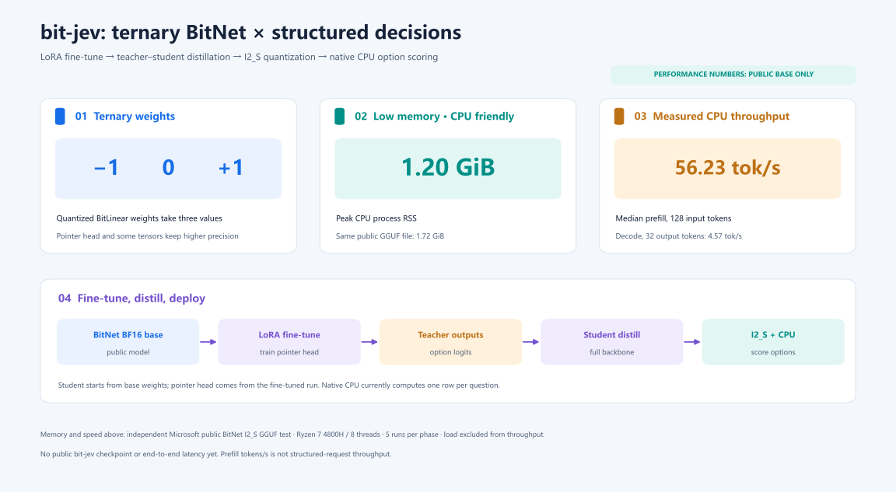

# bit-jev

[简体中文](README.md) · English

## bit-jev = bitnet + jev !!!

The backbone's quantized BitLinear weights use ternary values **{-1, 0, +1}**. A pointer head reads hidden states and scores caller-supplied options directly, so the model does not autoregressively generate answer text.

The code combines a BitNet backbone with a Kev-inspired decision interface. Comparisons with Kev require runnable public checkpoints, matched requests, and a common measurement protocol; no such comparison is claimed here.

> **Q: What is a jev / kev model?**
> A: Given one shared piece of content and several questions, the model computes scores and probabilities over the caller-supplied options — no answer text is generated token by token.

This repository is currently a source-and-measurement release. The Yelp-trained checkpoint and its derived benchmark bundle remain pending the written data-rights response requested from Yelp; the local AutoDL case study is documented separately and is not presented as a general speed claim.



The landing figure highlights quantized BitLinear ternary weights and the LoRA → teacher–student distillation → I2_S export path. **Ternary refers to quantized BitLinear weights, not every parameter.** See the [detailed neural framework](docs/figures/model-framework.svg) for the branch mask, decoder internals and pointer-head equations.

[CPU source quick start](docs/CPU_QUICKSTART.md) · [Architecture and artifact status](docs/MODEL_CARD.md) · [Benchmark protocol](docs/BENCHMARKS.md) · [Third-party notices](THIRD_PARTY_NOTICES.md)

## What the code implements

1. `core/bit_jev/api.py` defines the structured request and answer shapes.
2. `core/bit_jev/model.py` encodes the shared state, question branches, option boundaries, and pointer-head readout for the PyTorch path.
3. `core/bit_jev/export_distilled.py` and `core/bit_jev/cpu_head.py` prepare a compatible trained backbone and pointer head for native inference.
4. `core/bit_jev/cpu.py` encodes JSONL requests; `core/native/main.cpp` runs a quantized GGUF backbone and float32 pointer head, then returns option scores and probabilities.

The PyTorch packed path uses a block-causal mask so question branches can share the state computation while remaining isolated. The **native CPU runner evaluates one causal row per question** and repeats the shared state for multiquestion requests. A question can require several internal prefill batches. The absence of answer-token decoding does not mean every request completes in one hardware forward call or has negligible latency.

I2_S storage is intended to reduce backbone memory relative to less compressed formats. Actual process memory and request latency depend on the authorized model artifacts, input length, candidate count, CPU, thread count, and build. The [benchmark protocol](docs/BENCHMARKS.md) explains how to measure those quantities without conflating model load time and resident inference.

## Independent public BitNet base measurement

These charts measure **Microsoft's public original BitNet b1.58 2B GGUF backbone**, using the same I2_S file on both paths. They are separate from the bit-jev classification case study. The Vulkan path is hybrid: some I2_S weights remain CPU mapped.


| Path | 128 input token prefill | 32 output token decode | Peak process RAM | GPU global VRAM rise |
| --- | ---: | ---: | ---: | ---: |
| Ryzen 7 4800H, 8 threads, native CPU | 56.23 tokens/s; 2.28 s | 4.57 tokens/s; 7.01 s | 1.20 GiB | 0 GiB |
| RTX 2060, Vulkan hybrid | 45.20 tokens/s; 2.83 s | 3.56 tokens/s; 9.00 s | 1.91 GiB | 0.71 GiB |

Values are medians of five repetitions per phase; throughput **excludes model loading**. RAM is peak process RSS during loading and tests. VRAM is the change in global GPU use from the pre-run baseline, not process-exclusive allocation. The GGUF file is 1,844,472,032 bytes (1.72 GiB). On this setup the CPU path is faster; this does not generalize to other GPUs or bit-jev requests. See the [public base measurement record](docs/BENCHMARKS.md#microsoft-public-bitnet-base-independent-measurement) for samples, hashes and reproduction steps.

## Request shape

The JSONL CLI accepts one request per line. This is an **input example**, not a saved model prediction:

```json
{"state":"A customer reports a duplicate charge.","questions":{"team":{"type":"choice","instructions":"Which team should handle this?","criteria":{"billing":"Payment and refund issues","shipping":"Delivery issues"}},"escalate":{"type":"noul","instructions":"Does this require escalation?"}}}
```

The output schema contains answers, per-option logits or probabilities, and native compute latency. An actual answer depends on the model supplied by the user; none is implied by this example.

## Build and run

The [CPU quick start](docs/CPU_QUICKSTART.md) shows how to clone the source, install the Python launcher, fetch the pinned BitNet/llama.cpp revisions, and build the native runner. To classify a request, supply a matching tokenizer/configuration, I2_S GGUF backbone, and pointer-head sidecar with a documented redistribution basis.

All public performance claims should identify the checkpoint, license basis, hardware, precision, request shape, repeats, memory definition, and whether model load is included. The scripts under `test/` support that measurement once suitable artifacts are available.

## Attribution and license

bit-jev is a separate implementation inspired by [Kev](https://github.com/jaredpalmer/kev). [Microsoft BitNet](https://github.com/microsoft/BitNet) supplies the backbone family and native inference foundation. Repository code is licensed under [Apache-2.0](LICENSE); upstream source, base-model, and dataset terms are described in [third-party notices](THIRD_PARTY_NOTICES.md).
