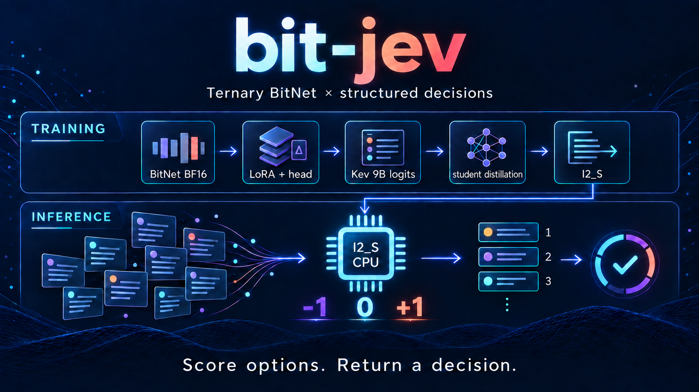
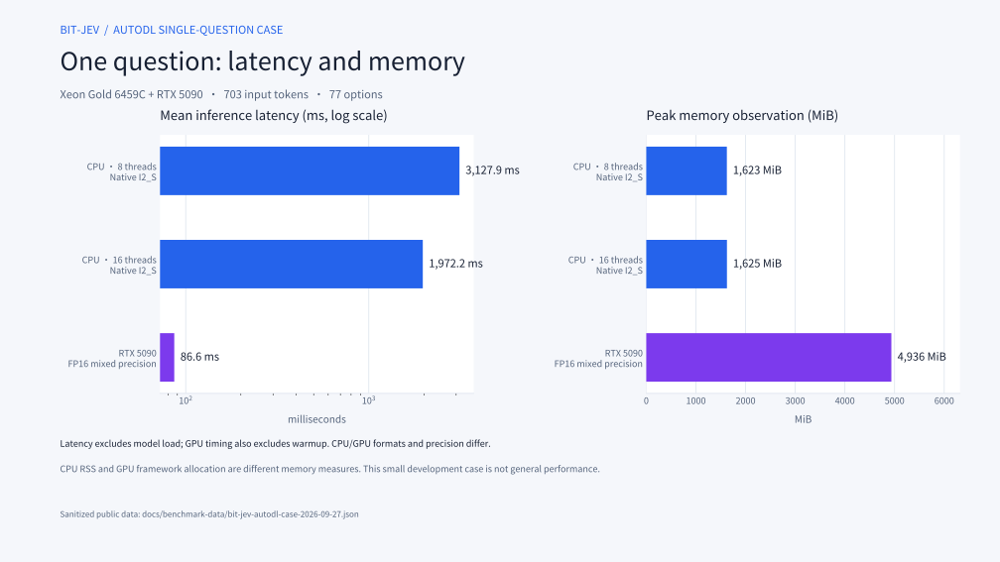
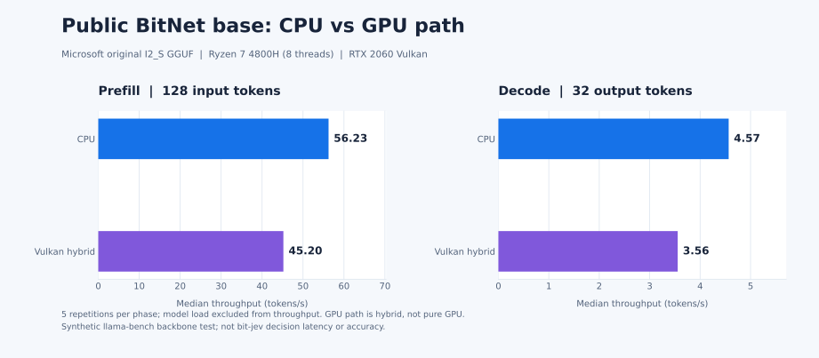
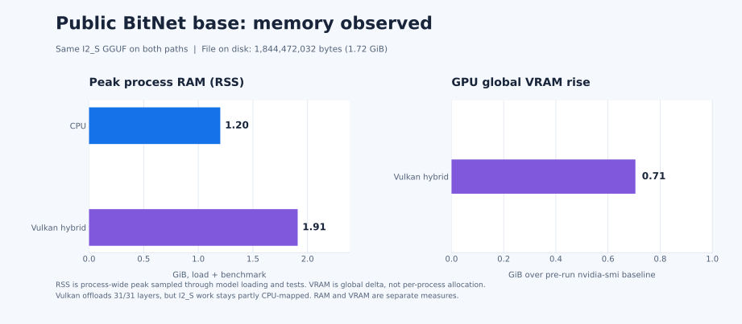

<div align="center">

# bit-jev

### Structured decisions on a 1.58-bit BitNet backbone

**I2_S GGUF · CPU / GPU inference · LoRA fine-tuning · teacher–student distillation**

[](https://pypi.org/project/bit-jev/) [](https://pypi.org/project/bit-jev/) [](LICENSE)

[Quick start](#quick-start) · [Benchmarks](#bit-jev-autodl-single-question-case) · [Architecture](#what-the-code-implements) · [简体中文](README.md) · [Hugging Face](https://huggingface.co/jinghao1632/bit-jev-2b-distilled)

</div>

> **Release update · 2026-09-28** The Python package downloads the public GGUF on first use and builds the pinned native runner on the target machine. `device="gpu"` selects Vulkan; `device="cuda"` needs a CUDA Toolkit. The first build requires [Git](https://git-scm.com/install/), [CMake 3.28+](https://cmake.org/download/), and a C++17 compiler ([Windows C++ Build Tools](https://learn.microsoft.com/cpp/build/vscpp-step-0-installation)). Git pins and patches upstream source; inference does not invoke Git.

## Quick start

```bash
pip install bit-jev
```

```python
from bit_jev import BitJev

request = {"state": "A customer reports a duplicate charge.", "questions": {"team": {"type": "choice", "instructions": "Which team should handle this?", "criteria": {"billing": "Payment and refunds", "shipping": "Delivery"}}}}
with BitJev.from_pretrained(device="cpu", threads=8) as model:
    print(model.infer(request)["answers"])
```

The GGUF is about 1.19 GB and is cached outside the wheel. The model remains loaded for subsequent `infer()` calls. Native `latency_ms` excludes model loading. See the [GGUF package guide](docs/GGUF_PACKAGE.md) for GPU, CLI, and local model directories. The repository license covers code; the model card describes the checkpoint's separate rights status.

## bit-jev = bitnet + jev !!!

The backbone's quantized BitLinear weights use ternary values **{-1, 0, +1}**. A pointer head reads hidden states and scores caller-supplied options directly, so the model does not autoregressively generate answer text.

The code combines a BitNet backbone with a Kev-inspired decision interface. Comparisons with Kev require runnable public checkpoints, matched requests, and a common measurement protocol; no such comparison is claimed here.

> **Q: What is a jev / kev model?**
> A: Given one shared piece of content and several questions, the model computes scores and probabilities over the caller-supplied options — no answer text is generated token by token.

The I2_S checkpoint and sanitized AutoDL measurements are now published on [Hugging Face](https://huggingface.co/jinghao1632/bit-jev-2b-distilled). The training set included Yelp review records. A permission request was sent; as of 2026-09-28, no written response has arrived. The model card states this provenance, the measurement limits, and that no standalone open-weights license has been specified.



The cover separates LoRA and teacher–student distillation from I2_S CPU option scoring. **Ternary refers to quantized BitLinear weights, not every parameter.** The [measurement highlights](docs/figures/model-highlights.en.svg) retain source details; the [detailed neural framework](docs/figures/model-framework.svg) shows the branch mask, decoder internals, and pointer-head equations.

[GGUF package guide](docs/GGUF_PACKAGE.md) · [CPU source quick start](docs/CPU_QUICKSTART.md) · [Architecture and artifact status](docs/MODEL_CARD.md) · [Benchmark protocol](docs/BENCHMARKS.md) · [Third-party notices](THIRD_PARTY_NOTICES.md)

## What the code implements

1. `core/bit_jev/api.py` defines the structured request and answer shapes.
2. `core/bit_jev/model.py` encodes the shared state, question branches, option boundaries, and pointer-head readout for the PyTorch path.
3. `core/bit_jev/export_distilled.py` and `core/bit_jev/cpu_head.py` prepare a compatible trained backbone and pointer head for native inference.
4. `core/bit_jev/encoding.py` encodes requests without loading PyTorch; `gguf.py` manages downloads and resident inference; `native_build.py` builds the pinned CPU/GPU runner; `core/native/main.cpp` scores options over the GGUF backbone and float32 pointer head.

The PyTorch packed path uses a block-causal mask so question branches can share the state computation while remaining isolated. The **native CPU runner evaluates one causal row per question** and repeats the shared state for multiquestion requests. A question can require several internal prefill batches. The absence of answer-token decoding does not mean every request completes in one hardware forward call or has negligible latency.

I2_S storage is intended to reduce backbone memory relative to less compressed formats. Actual process memory and request latency depend on the model artifacts, input length, candidate count, CPU, thread count, and build. The [benchmark protocol](docs/BENCHMARKS.md) explains how to measure those quantities without conflating model load time and resident inference.

### bit-jev AutoDL single-question case



One fixed development request used 703 input tokens and 77 options on the same Xeon Gold 6459C / RTX 5090 host. Timings exclude model load; GPU timing also excludes warmup.

| Path | Mean inference time | Repeats | Peak memory observation |
| --- | ---: | ---: | ---: |
| CPU, 8 threads, native I2_S | 3,127.88 ms | 3 | 1,622.74 MiB peak process RSS |
| CPU, 16 threads, native I2_S | 1,972.17 ms | 3 | 1,624.52 MiB peak process RSS |
| RTX 5090, FP16 mixed precision | 86.56 ms | 5 | 4,935.53 MiB peak GPU allocation |

On this request, the GPU path latency was about 22.8 times lower than the 16-thread CPU path. The two paths use different weight formats and numeric precision, so the ratio is not an isolated hardware speedup. Process RSS and GPU allocation are different memory measures. The [sanitized samples](docs/benchmark-data/bit-jev-autodl-case-2026-09-27.json) contain no input, option text, or prediction. This small case does not establish general latency or accuracy. Download the model from [Hugging Face](https://huggingface.co/jinghao1632/bit-jev-2b-distilled).

## Independent public BitNet base measurement

These charts measure **Microsoft's public original BitNet b1.58 2B GGUF backbone**, using the same I2_S file on both paths. They are separate from the bit-jev classification case study. The Vulkan path is hybrid: some I2_S weights remain CPU mapped.





| Path | 128 input token prefill | 32 output token decode | Peak process RAM | GPU global VRAM rise |
| --- | ---: | ---: | ---: | ---: |
| Ryzen 7 4800H, 8 threads, native CPU | 56.23 tokens/s; 2.28 s | 4.57 tokens/s; 7.01 s | 1.20 GiB | 0 GiB |
| RTX 2060, Vulkan hybrid | 45.20 tokens/s; 2.83 s | 3.56 tokens/s; 9.00 s | 1.91 GiB | 0.71 GiB |

Values are medians of five repetitions per phase; throughput **excludes model loading**. RAM is peak process RSS during loading and tests. VRAM is the change in global GPU use from the pre-run baseline, not process-exclusive allocation. The GGUF file is 1,844,472,032 bytes (1.72 GiB). On this setup the CPU path is faster; this does not generalize to other GPUs or bit-jev requests. See the [public base measurement record](docs/BENCHMARKS.md#microsoft-public-bitnet-base-independent-measurement) for samples, hashes and reproduction steps.

## Request shape

The JSONL CLI accepts one request per line. This is an **input example**, not a saved model prediction:

```json
{"state":"A customer reports a duplicate charge.","questions":{"team":{"type":"choice","instructions":"Which team should handle this?","criteria":{"billing":"Payment and refund issues","shipping":"Delivery issues"}},"escalate":{"type":"noul","instructions":"Does this require escalation?"}}}
```

The output schema contains answers, per-option logits or probabilities, and native compute latency. An actual answer depends on the model supplied by the user; none is implied by this example.

## Build and run

The [GGUF package guide](docs/GGUF_PACKAGE.md) covers `pip install bit-jev`, automatic model download, native builds, CPU/GPU selection, and resident inference. The [CPU source quick start](docs/CPU_QUICKSTART.md) covers manual builds. Read the Hugging Face card for data provenance and license status.

All public performance claims should identify the checkpoint, license basis, hardware, precision, request shape, repeats, memory definition, and whether model load is included. The scripts under `test/` support that measurement once suitable artifacts are available.

## Attribution and license

bit-jev is a separate implementation inspired by [Kev](https://github.com/jaredpalmer/kev). [Microsoft BitNet](https://github.com/microsoft/BitNet) supplies the backbone family and native inference foundation. Repository code is licensed under [Apache-2.0](LICENSE); upstream source, base-model, and dataset terms are described in [third-party notices](THIRD_PARTY_NOTICES.md).
