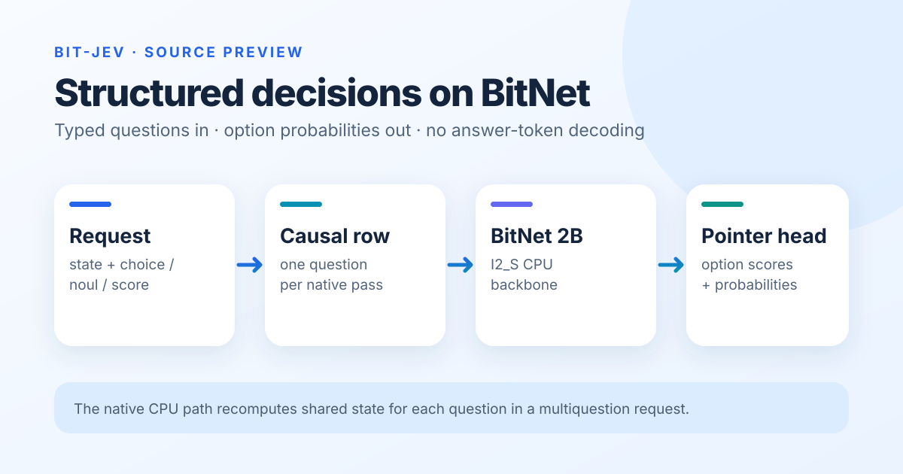

# bit-jev

**Structured decisions with a BitNet b1.58 backbone and a Kev-inspired pointer head.** A request supplies shared `state` and typed `choice`, `noul` (yes/no), or `score` questions. The head scores explicit options from backbone hidden states and returns decision probabilities without generating answer text token by token.

This is a **source-only research release**. It includes the implementation, pinned upstream bootstrap, native I2_S CPU runner, and measurement scripts. The project's trained checkpoint, its exported weights, and its benchmark results are withheld while training-data rights are reviewed. This repository does not currently offer a ready-to-run bit-jev model or a public speed/accuracy claim.



[CPU source quick start](docs/CPU_QUICKSTART.md) · [Architecture and artifact status](docs/MODEL_CARD.md) · [Benchmark protocol](docs/BENCHMARKS.md) · [Third-party notices](THIRD_PARTY_NOTICES.md)

## What the code implements

1. `core/bit_jev/api.py` defines the structured request and answer shapes.
2. `core/bit_jev/model.py` encodes the shared state, question branches, option boundaries, and pointer-head readout for the PyTorch path.
3. `core/bit_jev/export_distilled.py` and `core/bit_jev/cpu_head.py` prepare a compatible trained backbone and pointer head for native inference.
4. `core/bit_jev/cpu.py` encodes JSONL requests; `core/native/main.cpp` runs a quantized GGUF backbone and float32 pointer head, then returns option scores and probabilities.

The PyTorch packed path uses a block-causal mask so question branches can share the state computation while remaining isolated. The **native CPU runner evaluates one causal row per question** and repeats the shared state for multiquestion requests. A question can require several internal prefill batches. The absence of answer-token decoding does not mean every request completes in one hardware forward call or has negligible latency.

I2_S storage is intended to reduce backbone memory relative to less compressed formats. Actual process memory and request latency depend on the authorized model artifacts, input length, candidate count, CPU, thread count, and build. The [benchmark protocol](docs/BENCHMARKS.md) explains how to measure those quantities without conflating model load time and resident inference.

## Request shape

The JSONL CLI accepts one request per line. This is an **input example**, not a saved model prediction:

```json
{"state":"A customer reports a duplicate charge.","questions":{"team":{"type":"choice","instructions":"Which team should handle this?","criteria":{"billing":"Payment and refund issues","shipping":"Delivery issues"}},"escalate":{"type":"noul","instructions":"Does this require escalation?"}}}
```

The output schema contains answers, per-option logits or probabilities, and native compute latency. An actual answer depends on the model supplied by the user; none is implied by this example.

## Build and run

The [CPU quick start](docs/CPU_QUICKSTART.md) shows how to clone the source, install the Python launcher, fetch the pinned BitNet/llama.cpp revisions, and build the native runner. To classify a request, supply your **own compatible model artifacts with rights to use them**: a matching tokenizer/configuration, I2_S GGUF backbone, and pointer-head sidecar. The repository does not download or publish the withheld trained checkpoint.

All public performance claims should identify the checkpoint, license basis, hardware, precision, request shape, repeats, memory definition, and whether model load is included. The scripts under `test/` support that measurement once suitable artifacts are available.

## Attribution and license

bit-jev is a separate implementation inspired by [Kev](https://github.com/jaredpalmer/kev). [Microsoft BitNet](https://github.com/microsoft/BitNet) supplies the backbone family and native inference foundation. Repository code is licensed under [Apache-2.0](LICENSE); upstream source, base-model, and dataset terms are described in [third-party notices](THIRD_PARTY_NOTICES.md).
