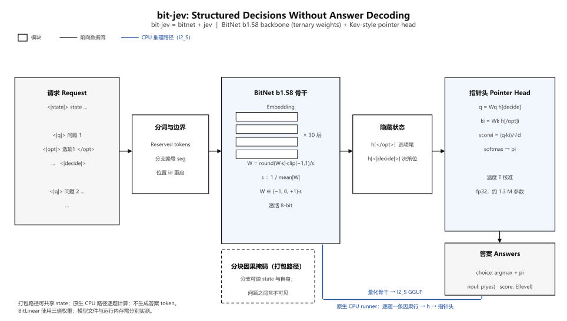

# bit-jev

简体中文 · [English](README.md)

## bit-jev = bitnet + jev ！！！

骨干网络中的 BitLinear 权重在量化推理时使用 **{-1, 0, +1}** 三值，有利于缩小 CPU 部署所需的模型存储。指针头及部分其他张量仍保留较高精度。当前没有公开的 bit-jev 检查点，因此不能给出可独立复现的端到端速度或模型加载内存数字。

项目将 BitNet 骨干与受 Kev 启发的判断接口结合。要与 Kev 比较，需要双方可运行的公开检查点、相同请求和统一测量方法；目前不宣称参数量比例或速度倍数。

> **Q：什么是 jev / kev 模型？**
> A：输入一段共享内容及多个问题，模型对调用者明确给出的选项计算分数与概率，无需逐 token 生成回答文本。

> **当前发布状态：v0.5.7 纯源码预览。** 仓库提供实现、原生 CPU 构建步骤和测量工具；不提供已训练的 bit-jev 权重、I2_S GGUF、指针头文件、模型输出或该检查点的性能数据。此前研究检查点涉及分发条件尚未厘清的训练数据，因此暂不公开。仅克隆仓库无法立即运行 bit-jev 分类。



[CPU 构建与使用](docs/CPU_QUICKSTART.zh-CN.md) · [性能测量规范](docs/BENCHMARKS.zh-CN.md) · [架构与模型文件状态](docs/MODEL_CARD.zh-CN.md) · [第三方许可说明](THIRD_PARTY_NOTICES.md)

## 项目要点

| 能力 | 当前实现 |
| --- | --- |
| 结构化问题 | 一次请求可包含 `choice`（多选）、`noul`（是/否）和 `score`（有序评分），每个问题对明确的候选答案打分。 |
| 非生成式输出 | 指针头读取骨干网络的隐藏状态，直接给出选项分数与概率；不会自回归地生成答案文本。 |
| CPU 路径 | 原生程序读取 I2_S GGUF 骨干及 float32 指针头，以 JSONL 接收请求并输出结果。运行时需要用户自行提供兼容且有权使用的模型文件。 |
| 多问题执行 | PyTorch 打包路径可用分块因果注意力掩码共享 `state` 计算；目前原生 CPU 路径按问题构造独立因果序列，会重复计算共享内容。 |
| 可核查的测量 | 仓库提供 CPU 与 GPU 实验脚本以及记录延迟、内存和输入形状的规范；当前纯源码版本没有可供公开复现的检查点成绩。 |

这一项目受 [Kev](https://github.com/jaredpalmer/kev) 的结构化判断接口启发，底层选用 [Microsoft BitNet b1.58 2B 系列](https://huggingface.co/microsoft/bitnet-b1.58-2B-4T-bf16)的骨干设计。项目与 Kev 的权重、模型表和结果相互独立；本仓库尚未发布可直接下载的 bit-jev 模型。

## 请求长什么样

一个 UTF-8 JSONL 文件每行放一个请求。下面只展示**输入格式**，不是模型预测：

```json
{"state":"客户报告同一订单被重复扣款。","questions":{"team":{"type":"choice","instructions":"哪个团队应处理这个问题？","criteria":{"billing":"支付与退款","shipping":"配送问题"}},"escalate":{"type":"noul","instructions":"是否需要升级处理？"}}}
```

`state` 是各问题共享的内容；`questions` 中的键由调用方命名。`choice` 的 `criteria` 列出候选项，`noul` 是是/否判断，`score` 使用有序等级。已有兼容模型时，程序返回各问题的答案、选项分数与概率及原生计算耗时。此仓库没有已训练模型，因此不展示臆造的预测值。

## 工作过程

```text
共享 state + 各问题及候选项
           ↓ 分词并插入专用边界标记
BitNet 骨干计算隐藏状态
           ↓ 在选项结尾和决策位置读取状态
指针头给候选项打分 → 概率与结构化答案
```

“不逐 token 生成答案”只省去了**答案解码循环**。输入仍需经过骨干网络的前向计算，长内容和大量选项会增加耗时。目前原生 CPU 程序每个问题运行一条因果序列；序列可能分成多个内部预填充批次。因此，不能把一个请求说成只需一次硬件前向调用，也不能用“输出 tokens/s”描述它的速度。更适合报告的是**每请求耗时、每问题耗时和峰值常驻内存**。详见[性能测量规范](docs/BENCHMARKS.zh-CN.md)。

## 从源码开始

准备 Python 3.11/3.12、Git、CMake 3.28+、C++17 编译器，以及与你的平台匹配的 PyTorch。克隆并安装 Python 包：

```powershell
git clone https://github.com/Zeaulo/bit-jev.git
Set-Location bit-jev
python -m pip install -e './core'
python test/bootstrap_bitnet.py
python test/bootstrap_bitnet.py --check
```

`bootstrap_bitnet.py` 从上游取得固定版本的 BitNet/llama.cpp 源码，并应用仓库中的兼容补丁。首次执行需要网络。Windows MinGW 和 Linux 的 CMake 命令、输入文件示例及 CLI 参数见 [CPU 构建与使用](docs/CPU_QUICKSTART.zh-CN.md)。构建原生程序不需要 bit-jev 权重；实际推理则必须另外准备匹配的分词器、I2_S GGUF 骨干和训练好的指针头。

## 速度与内存怎么比较

下面两张图只测量微软公开的 **BitNet b1.58 2B 原版骨干 GGUF**，不是 bit-jev 分类请求，也不是本项目未发布检查点的成绩。两条路径使用完全相同的 I2_S 文件；GPU 路径采用 Vulkan 混合执行，权重仍有一部分由 CPU 映射。


| 路径 | 128 输入 token 预填充 | 32 输出 token 解码 | 进程峰值 RAM | GPU 全局显存增量 |
| --- | ---: | ---: | ---: | ---: |
| Ryzen 7 4800H，8 线程，原生 CPU | 56.23 token/s；2.28 s | 4.57 token/s；7.01 s | 1.20 GiB | 0 GiB |
| RTX 2060，Vulkan 混合路径 | 45.20 token/s；2.83 s | 3.56 token/s；9.00 s | 1.91 GiB | 0.71 GiB |

这些数值是每阶段 5 次测量的中位数，**吞吐计时不含模型加载**。RAM 是加载及测试过程中的进程 RSS 峰值；显存是运行前基线到运行中整卡占用峰值的差，不能视为该进程独占。GGUF 磁盘大小为 1,844,472,032 字节（1.72 GiB）。当前配置下 CPU 路径更快；这不能推断所有 GPU 或真正 bit-jev 任务都如此。完整样本、模型哈希、修订与复现方法见[公开基础模型测量记录](docs/BENCHMARKS.zh-CN.md#微软公开-bitnet-基础模型独立实测)。

当前公开仓库仍没有可下载的**匹配 bit-jev 检查点**，因此没有可复现的 bit-jev CPU/GPU 分类成绩。其性能应按每请求耗时、每问题耗时和峰值内存测量，而非套用上图的输出 token/s。

## 代码从哪里读起

| 路径 | 作用 |
| --- | --- |
| [`core/bit_jev/api.py`](core/bit_jev/api.py) | 验证结构化请求并整理 `choice`、`noul`、`score` 的答案。 |
| [`core/bit_jev/model.py`](core/bit_jev/model.py) | 构造分支编码与掩码、运行 PyTorch 骨干、通过指针头评分。 |
| [`core/bit_jev/cpu.py`](core/bit_jev/cpu.py) | 把 JSONL 请求编码成 CPU 因果序列，并驱动常驻原生进程。 |
| [`core/native/main.cpp`](core/native/main.cpp) | 加载 GGUF 和指针头，在 CPU 上计算隐藏状态与选项分数。 |
| [`core/bit_jev/export_distilled.py`](core/bit_jev/export_distilled.py) | 将用户自己的兼容检查点导出为原生推理所需的模型文件。 |
| [`test/bootstrap_bitnet.py`](test/bootstrap_bitnet.py) | 固定上游版本，应用并检查构建补丁。 |

## 许可与边界

本仓库的代码采用 [Apache-2.0](LICENSE) 许可。BitNet 上游、基础模型、教师模型和数据集各自保留原有条款，详见[第三方许可说明](THIRD_PARTY_NOTICES.md)。代码许可不等于获得训练数据或训练后权重的公开分发权。使用自己的数据训练和发布模型前，请先核对所有输入来源的许可与用途限制。
