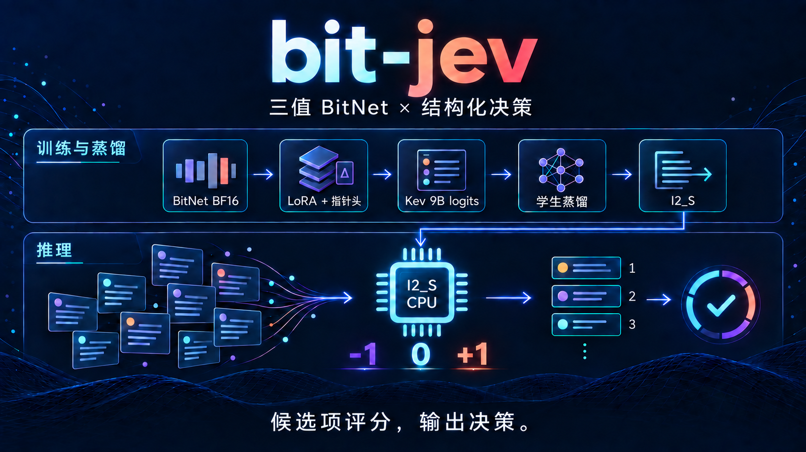
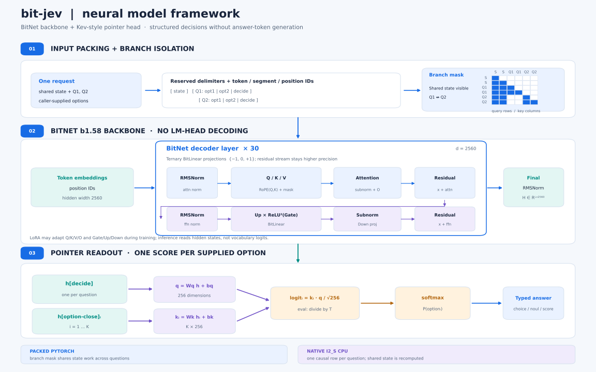

# bit-jev

> 兼容入口：中文默认首页为 [README.md](README.md)。


BitNet 骨干 + Kev 风格结构化决策头：把一段共享内容和多个问题直接映射为候选项分数、概率与答案，不生成回答文本。

[English documentation](README.en.md) · [项目总览](versions/project_overall/index.html) · [GitHub Releases](https://github.com/Zeaulo/bit-jev/releases) · [Hugging Face 模型与模型卡](https://huggingface.co/jinghao1632/bit-jev-2b-distilled)



封面把 LoRA、教师学生蒸馏与 I2_S CPU 评分分成两条链路。图中的 `-1 / 0 / +1` 指量化 BitLinear 权重；[三值权重与公开基础模型测量详图](docs/figures/model-highlights.zh-CN.svg)保留数值来源和边界。

## 先看结论

| 重点 | 说明 |
| --- | --- |
| 三值骨干 | 量化后的 BitLinear 权重使用 `-1 / 0 / +1`；这不是所有张量都只有三值。 |
| CPU 友好 | I2_S GGUF 压缩骨干配合原生 CPU runner，适合低内存部署。 |
| 非自回归决策 | 指针头直接读取隐藏状态，对选项打分；不需要逐 token 生成答案。 |
| 训练链路 | BitNet BF16 基础模型 → LoRA 微调 → teacher-student 蒸馏 → I2_S 导出。 |
| 任务类型 | `choice` 多选、`noul` 是/否、`score` 有序评分。 |

## 这个项目解决什么问题

通用语言模型擅长生成文本，但很多业务任务只需要在固定选项中做判断。bit-jev 把这类任务改成结构化推理：共享 `state` 只作为上下文输入，调用方声明问题和候选项，模型输出每个问题的答案、选项分数和概率。

模型不会自回归地“蹦”出答案 token。需要注意的是，省去的是答案解码循环，输入仍然要经过 BitNet 骨干的前向计算；当前原生 CPU 路径对多问题请求按问题构造因果序列，因此不能把一次请求简单描述成“一次前向计算”。

## 模型流程



1. `train.py` 在 Microsoft BitNet BF16 骨干上训练 LoRA 与指针头。
2. `distill.py export_teacher` 提取教师模型对候选项的 logits。
3. `distill.py train` 使用 teacher logits 训练不带 LoRA 的完整学生骨干。
4. `export_distilled.py` 将学生骨干导出为 I2_S GGUF，并配套 float32 指针头。
5. 原生 runner 读取 JSONL 请求，返回结构化判断结果。

## 速度与内存

公开报告必须同时写清检查点、格式、精度、硬件、输入形状、重复次数和内存口径。仓库保留两类测量：微软公开 BitNet 基础模型的可复现实测，以及本项目训练检查点的 AutoDL 案例数据。两类数据不混在同一张图里。

### 微软公开 BitNet 基础模型


这是骨干模型的合成 prefill/decode 测量，不是 bit-jev 分类请求。完整样本和复现命令见[性能测量规范](docs/BENCHMARKS.zh-CN.md)。

### bit-jev AutoDL 单题案例


同一台 Xeon Gold 6459C / RTX 5090 主机上测试一道固定开发题，输入 703 tokens、77 个候选项；下表均不计模型加载时间。GPU 测试另排除预热。

| 路径 | 平均推理时间 | 重复次数 | 峰值内存观测 |
| --- | ---: | ---: | ---: |
| CPU，8 线程，I2_S 原生 | 3,127.88 ms | 3 | 进程峰值 RSS 1,622.74 MiB |
| CPU，16 线程，I2_S 原生 | 1,972.17 ms | 3 | 进程峰值 RSS 1,624.52 MiB |
| RTX 5090，FP16 混合精度 | 86.56 ms | 5 | GPU 峰值分配 4,935.53 MiB |

该单题上 GPU 路径约为 16 线程 CPU 路径的 22.8 倍；但两条路径使用不同权重格式和数值精度，不能据此声称纯硬件加速倍数。CPU RSS 与 GPU 分配显存口径不同。原始输入、候选内容和预测值均未公开；逐次计时、模型 SHA-256、实验边界和图表生成脚本见[公开案例数据](docs/benchmark-data/bit-jev-autodl-case-2026-09-27.json)与[性能测量规范](docs/BENCHMARKS.zh-CN.md#bit-jev-autodl-单题案例)。这组小样本不代表通用延迟或准确率。模型权重可从 [Hugging Face](https://huggingface.co/jinghao1632/bit-jev-2b-distilled) 下载；使用前请阅读模型卡中的数据来源和许可状态。

## 快速开始

```powershell
git clone https://github.com/Zeaulo/bit-jev.git
Set-Location bit-jev
python -m pip install -e './core'
python test/bootstrap_bitnet.py
python test/bootstrap_bitnet.py --check
```

构建原生程序不需要下载本项目检查点。实际推理需要兼容的 tokenizer/config、I2_S GGUF 骨干和指针头 sidecar；请先确认模型与数据拥有可公开使用的权利。

公开模型包位于 [Hugging Face](https://huggingface.co/jinghao1632/bit-jev-2b-distilled)，本项目 [CPU 快速开始](docs/CPU_QUICKSTART.zh-CN.md)含下载及运行步骤。

## 请求格式

```json
{"state":"客户报告同一订单被重复扣款。","questions":{"team":{"type":"choice","instructions":"哪个团队应处理这个问题？","criteria":{"billing":"支付与退款","shipping":"配送问题"}},"escalate":{"type":"noul","instructions":"是否需要升级处理？"}}}
```

一个 UTF-8 JSONL 文件每行一个请求。`state` 在问题之间共享；`questions` 的键由调用方命名。兼容模型返回问题答案、候选项分数、概率和原生计算耗时。

## 文档地图

| 文档 | 适合谁 | 内容 |
| --- | --- | --- |
| [中文 CPU 快速开始](docs/CPU_QUICKSTART.zh-CN.md) | 第一次运行 | 构建、模型文件和 JSONL 调用。 |
| [中文性能规范](docs/BENCHMARKS.zh-CN.md) | 做实验 | 加载、预热、推理、RSS、显存和线程数的统一口径。 |
| [中文模型卡](docs/MODEL_CARD.zh-CN.md) | 评估模型 | 架构、输入契约、局限和发布边界。 |
| [Hugging Face 中文模型卡](docs/HF_MODEL_CARD.zh-CN.md) | 评估权重 | 训练流程、AutoDL 案例、数据来源、文件哈希和限制。 |
| [英文 README](README.en.md) | English readers | English overview and reproduction links. |
| [第三方许可](THIRD_PARTY_NOTICES.md) | 发布前 | BitNet、Kev、数据集和检查点的权利边界。 |
| [项目总览网页](versions/project_overall/index.html) | 内部学习 | 代码逻辑、功能需求、数据流和关键目录。 |

## 代码入口

- [`core/bit_jev/api.py`](core/bit_jev/api.py)：请求和答案结构。
- [`core/bit_jev/model.py`](core/bit_jev/model.py)：PyTorch 骨干、分支掩码和指针头。
- [`core/bit_jev/cpu.py`](core/bit_jev/cpu.py)：JSONL 编码与原生进程调用。
- [`core/native/main.cpp`](core/native/main.cpp)：GGUF 骨干和 float32 指针头的 CPU 推理。
- [`core/bit_jev/train.py`](core/bit_jev/train.py)：LoRA 与指针头训练。
- [`core/bit_jev/distill.py`](core/bit_jev/distill.py)：教师 logits 导出和学生蒸馏。
- [`test/`](test/)：构建、基准测试、图表渲染和发布校验脚本。

## 发布状态与许可

仓库代码采用 [Apache-2.0](LICENSE)。I2_S 检查点与脱敏 AutoDL 派生指标现已发布到 [Hugging Face](https://huggingface.co/jinghao1632/bit-jev-2b-distilled)。训练集包含 Yelp 评论记录；许可申请已发出，截至 2026-09-28 尚未收到书面答复。本项目没有为权重另行指定开放许可证，代码仓库许可证不自动覆盖权重或第三方数据。公开案例只含聚合计时与内存，不含评论原文、候选内容或模型预测。

## 引用与致谢

项目实现受 [Kev](https://github.com/jaredpalmer/kev) 的结构化判断接口启发，骨干和原生推理基础来自 [Microsoft BitNet](https://github.com/microsoft/BitNet)。bit-jev 与这些项目的权重、训练结果和许可相互独立。
